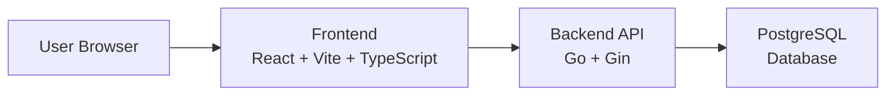

# UniRide – System Architecture and Technical Decisions

Architecture and technical documentation for the **UniRide ride-sharing platform**.

This document describes the **system architecture, technology stack, development workflow, and MVP scope**.

---

# Table of Contents

1. Introduction  
2. Project Overview  
3. Problem Statement  
4. Product Vision  
5. Technology Stack  
6. System Architecture  
7. Authentication  
8. Local Development Environment  
9. Deployment  
10. CI/CD  
11. Development Workflow  
12. MVP Scope  
13. Design Principles  
14. Summary  

---

# 1. Introduction

This document defines the main architectural and technical decisions for the **UniRide** project.

The goal is to establish a clear technical foundation before development begins.

Defining these decisions early helps ensure:

- consistency
- maintainability
- realistic project scope

This document describes:

- the system architecture
- the selected technologies
- the development workflow
- the scope of the first version (MVP)

---

# 2. Project Overview

**UniRide** is a web platform designed to facilitate ride sharing within a university community.

The platform allows students to coordinate **specific trips to or from campus** by sharing available seats in their vehicles.

A user acting as a **driver** can publish a trip specifying:

- origin
- destination
- date and time
- number of available seats

Other users can browse available trips and request a seat.

The driver can approve or reject these requests.

Each trip represents an **independent trip instance** created for a specific date and time.

---

# 3. Problem Statement

Many students commute daily using private vehicles with empty seats.

This situation generates several problems:

- increased transportation costs
- traffic congestion near campus
- unnecessary environmental impact
- lack of coordination between students living in similar areas

Existing solutions are poorly adapted to the academic environment:

- ride-hailing platforms focus on commercial transportation
- carpooling platforms focus on intercity travel
- messaging groups provide poor organization

UniRide addresses this problem by offering a **structured ride-sharing platform limited to the university community**.

---

# 4. Product Vision

The objective of UniRide is to allow students to:

- publish trips they plan to take
- search for available trips
- request a seat
- approve or reject requests
- track trip history
- build trust through a rating system

The platform focuses on **peer coordination**, not commercial transportation.

---

# 5. Technology Stack

The selected stack balances **simplicity, maintainability, and project constraints**.

---

## Backend

Implemented using:

- **Go (Golang)**
- **Gin HTTP Framework**

Reasons:

- Go is required by the project specification
- Gin is lightweight and well suited for REST APIs
- enables clear and modular backend structure

Responsibilities:

- authentication
- trip management
- seat requests
- business logic
- database communication

---

## Database

The system uses **PostgreSQL**.

Reasons:

- SQL database required by the project
- reliable and widely used
- strong support for relational modeling

Stored data includes:

- users
- user profiles
- trips
- trip requests
- ratings

---

## Frontend

Implemented as a **Single Page Application (SPA)** using:

- **React**
- **Vite**
- **TypeScript**

Reasons:

- React ecosystem and popularity
- Vite provides fast builds
- TypeScript improves maintainability

Responsibilities:

- UI rendering
- API communication
- application state management

---

# 6. System Architecture

The system follows a **client–server architecture**.



### Components

**Frontend (Client)**  
A React application running in the user's browser.

**Backend (Server)**  
A REST API written in Go that implements the business logic.

**Database**  
PostgreSQL database storing persistent application data.

This architecture keeps the system:

- simple
- modular
- maintainable

---

# 7. Authentication

Authentication will use **JWT (JSON Web Tokens)**.

Authentication flow:

1. User registers or logs in
2. Server validates credentials
3. Server generates a JWT token
4. Client sends the token in future requests

Protected API endpoints require a valid token.

Passwords are stored using **secure hashing**.

---

# 8. Local Development Environment

Development environments are managed using:

- **Docker**
- **Docker Compose**

Benefits:

- consistent environments
- simple project setup
- easy backend/database orchestration

---

# 9. Deployment

The application must be accessible through a web browser.

Recommended deployment platform:

**Render**

Render allows deployment of:

- backend services
- PostgreSQL databases
- frontend applications

The `main` branch always represents the **latest deployed version**.

---

# 10. CI/CD

Continuous Integration and Deployment will be implemented using:

**GitHub Actions**

Pipelines will:

- build the project
- run automated tests
- validate code quality
- support deployment workflows

This improves **code quality and project stability**.

---

# 11. Development Workflow

The project follows **Trunk Based Development**.

Principles:

- `main` is the primary integration branch
- feature branches are short-lived
- frequent merges
- Pull Requests required

Benefits:

- continuous integration
- fewer merge conflicts
- simpler collaboration

---

# 12. MVP Scope

The first version focuses on the **core ride-sharing workflow**.

---

## Included Features

The MVP includes:

- user registration
- user login
- basic user profiles
- trip creation
- trip listing
- trip search and filtering
- trip details
- seat request workflow
- driver approval or rejection
- trip participation tracking
- trip history
- basic rating system

---

## Excluded Features

To maintain feasibility, the following are excluded:

- integrated payments
- recurring automatic bookings
- native mobile apps
- real-time GPS tracking
- advanced route optimization
- microservices architecture

These may be considered future improvements.

---

# 13. Design Principles

UniRide development follows these principles.

### Simplicity

Prefer simple solutions that effectively solve the problem.

### Code Clarity

The codebase should remain readable and maintainable.

### Separation of Responsibilities

Frontend, backend, and database layers should be clearly separated.

### Realistic Scope

Focus on delivering a stable MVP.

### Defendable Decisions

Technical decisions must be easy to justify during evaluation.

---

# 14. Summary

UniRide will be developed as a **web-based client–server application** designed to coordinate ride sharing between university students.

Technology stack:

- **React + Vite + TypeScript** → Frontend
- **Go + Gin** → Backend
- **PostgreSQL** → Database

The architecture follows a **modular monolith design with REST APIs and JWT authentication**.

Core workflow:

```
create trip
    ↓
request seat
    ↓
approve or reject request
    ↓
complete trip
    ↓
rate participants
```

Advanced features such as **payments, GPS tracking, and route optimization** are intentionally excluded from the MVP to keep the project achievable within the course timeline.