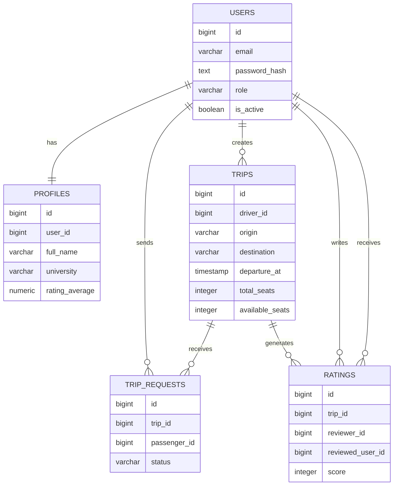

# UniRide – Database Schema

Database schema documentation for the **UniRide ride-sharing platform**.

This document describes the relational structure used by the backend and implemented in **PostgreSQL**.

---

# Table of Contents

1. Introduction  
2. Design Principles  
3. Identifier Strategy  
4. Entity Relationship Diagram  
5. Tables  
6. Relationships Summary  
7. Status Values  
8. Indexing Strategy  
9. Important Modeling Decisions  
10. Summary  

---

# 1. Introduction

This document defines the relational database schema for the **UniRide** platform.

Its purpose is to translate the domain model into a clear and consistent SQL design that can be implemented in PostgreSQL.

The schema is designed to be:

- simple
- relational
- easy to implement
- easy to maintain
- appropriate for the MVP scope

The database structure is based on the following core entities:

- User
- Profile
- Trip
- TripRequest
- Rating

---

# 2. Design Principles

The database schema follows these principles:

- use a relational structure that reflects the business domain clearly
- keep the number of tables small and meaningful
- enforce integrity through primary keys, foreign keys, unique constraints, and checks
- avoid unnecessary complexity in the MVP
- support the main ride-sharing workflow efficiently

Trip participation is derived from **approved trip requests**, therefore a separate `trip_passengers` table is not required for the MVP.

---

# 3. Identifier Strategy

All main tables use `BIGSERIAL` as the primary key type.

Reasons:

- simple implementation
- native PostgreSQL support
- easy integration with backend services
- ideal for MVP/student projects

---

# 4. Entity Relationship Diagram



---

# 5. Tables

## 5.1 users

Stores authentication and account information.

### SQL

```sql
CREATE TABLE users (
    id BIGSERIAL PRIMARY KEY,
    email VARCHAR(255) NOT NULL UNIQUE,
    password_hash TEXT NOT NULL,
    role VARCHAR(20) NOT NULL DEFAULT 'student',
    is_active BOOLEAN NOT NULL DEFAULT TRUE,
    created_at TIMESTAMP NOT NULL DEFAULT CURRENT_TIMESTAMP,
    updated_at TIMESTAMP NOT NULL DEFAULT CURRENT_TIMESTAMP,
    CONSTRAINT chk_users_role CHECK (role IN ('student', 'admin'))
);
```

---

## 5.2 profiles

Stores additional user profile information.

Each user has exactly **one profile**.

```sql
CREATE TABLE profiles (
    id BIGSERIAL PRIMARY KEY,
    user_id BIGINT NOT NULL UNIQUE,
    full_name VARCHAR(255) NOT NULL,
    university VARCHAR(255),
    phone_number VARCHAR(50),
    avatar_url TEXT,
    bio TEXT,
    rating_average NUMERIC(2,1) NOT NULL DEFAULT 0.0,
    created_at TIMESTAMP NOT NULL DEFAULT CURRENT_TIMESTAMP,
    updated_at TIMESTAMP NOT NULL DEFAULT CURRENT_TIMESTAMP,
    CONSTRAINT fk_profiles_user
        FOREIGN KEY (user_id) REFERENCES users(id) ON DELETE CASCADE,
    CONSTRAINT chk_profiles_rating_average
        CHECK (rating_average >= 0.0 AND rating_average <= 5.0)
);
```

---

## 5.3 trips

Stores trips created by drivers.

This is the **central table of the platform**.

```sql
CREATE TABLE trips (
    id BIGSERIAL PRIMARY KEY,
    driver_id BIGINT NOT NULL,
    origin VARCHAR(255) NOT NULL,
    destination VARCHAR(255) NOT NULL,
    departure_at TIMESTAMP NOT NULL,
    total_seats INTEGER NOT NULL,
    available_seats INTEGER NOT NULL,
    price_per_seat NUMERIC(10,2) NOT NULL DEFAULT 0.00,
    status VARCHAR(20) NOT NULL DEFAULT 'created',
    notes TEXT,
    created_at TIMESTAMP NOT NULL DEFAULT CURRENT_TIMESTAMP,
    updated_at TIMESTAMP NOT NULL DEFAULT CURRENT_TIMESTAMP,
    CONSTRAINT fk_trips_driver
        FOREIGN KEY (driver_id) REFERENCES users(id) ON DELETE CASCADE,
    CONSTRAINT chk_trips_total_seats
        CHECK (total_seats > 0),
    CONSTRAINT chk_trips_available_seats
        CHECK (available_seats >= 0 AND available_seats <= total_seats),
    CONSTRAINT chk_trips_price_per_seat
        CHECK (price_per_seat >= 0),
    CONSTRAINT chk_trips_status
        CHECK (status IN ('created', 'open', 'full', 'completed', 'cancelled'))
);
```

---

## 5.4 trip_requests

Stores passenger requests to join trips.

```sql
CREATE TABLE trip_requests (
    id BIGSERIAL PRIMARY KEY,
    trip_id BIGINT NOT NULL,
    passenger_id BIGINT NOT NULL,
    status VARCHAR(20) NOT NULL DEFAULT 'pending',
    message TEXT,
    created_at TIMESTAMP NOT NULL DEFAULT CURRENT_TIMESTAMP,
    updated_at TIMESTAMP NOT NULL DEFAULT CURRENT_TIMESTAMP,
    CONSTRAINT fk_trip_requests_trip
        FOREIGN KEY (trip_id) REFERENCES trips(id) ON DELETE CASCADE,
    CONSTRAINT fk_trip_requests_passenger
        FOREIGN KEY (passenger_id) REFERENCES users(id) ON DELETE CASCADE,
    CONSTRAINT uq_trip_requests_trip_passenger
        UNIQUE (trip_id, passenger_id),
    CONSTRAINT chk_trip_requests_status
        CHECK (status IN ('pending', 'approved', 'rejected', 'cancelled'))
);
```

---

## 5.5 ratings

Stores feedback between users after trips.

```sql
CREATE TABLE ratings (
    id BIGSERIAL PRIMARY KEY,
    trip_id BIGINT NOT NULL,
    reviewer_id BIGINT NOT NULL,
    reviewed_user_id BIGINT NOT NULL,
    score INTEGER NOT NULL,
    comment TEXT,
    created_at TIMESTAMP NOT NULL DEFAULT CURRENT_TIMESTAMP,
    CONSTRAINT fk_ratings_trip
        FOREIGN KEY (trip_id) REFERENCES trips(id) ON DELETE CASCADE,
    CONSTRAINT fk_ratings_reviewer
        FOREIGN KEY (reviewer_id) REFERENCES users(id) ON DELETE CASCADE,
    CONSTRAINT fk_ratings_reviewed_user
        FOREIGN KEY (reviewed_user_id) REFERENCES users(id) ON DELETE CASCADE,
    CONSTRAINT uq_ratings_trip_reviewer_reviewed
        UNIQUE (trip_id, reviewer_id, reviewed_user_id),
    CONSTRAINT chk_ratings_score
        CHECK (score BETWEEN 1 AND 5),
    CONSTRAINT chk_ratings_not_self
        CHECK (reviewer_id <> reviewed_user_id)
);
```

---

# 6. Relationships Summary

- one user has one profile  
- one user can create many trips  
- one user can create many trip requests  
- one trip can receive many trip requests  
- one trip can generate many ratings  
- one user can write many ratings  
- one user can receive many ratings  

Trip participation is inferred from:

```
trip_requests.status = 'approved'
```

---

# 7. Status Values

## Trip Status

```
created
open
full
completed
cancelled
```

## Trip Request Status

```
pending
approved
rejected
cancelled
```

---

# 8. Indexing Strategy

### users

```sql
CREATE UNIQUE INDEX idx_users_email ON users(email);
```

### profiles

```sql
CREATE UNIQUE INDEX idx_profiles_user_id ON profiles(user_id);
```

### trips

```sql
CREATE INDEX idx_trips_driver_id ON trips(driver_id);
CREATE INDEX idx_trips_status ON trips(status);
CREATE INDEX idx_trips_departure_at ON trips(departure_at);
CREATE INDEX idx_trips_search ON trips(origin, destination, departure_at, status);
```

### trip_requests

```sql
CREATE INDEX idx_trip_requests_trip_id ON trip_requests(trip_id);
CREATE INDEX idx_trip_requests_passenger_id ON trip_requests(passenger_id);
```

### ratings

```sql
CREATE INDEX idx_ratings_trip_id ON ratings(trip_id);
CREATE INDEX idx_ratings_reviewed_user_id ON ratings(reviewed_user_id);
```

---

# 9. Important Modeling Decisions

Key design choices:

- users and profiles are separated to isolate authentication from profile data
- departure time is stored as a single `TIMESTAMP`
- both `total_seats` and `available_seats` are stored for simplicity
- duplicate trip requests prevented with `(trip_id, passenger_id)`
- duplicate ratings prevented with `(trip_id, reviewer_id, reviewed_user_id)`
- trip participation derived from approved requests

---

# 10. Summary

The **UniRide database schema** contains five core tables:

- users
- profiles
- trips
- trip_requests
- ratings

Supported workflow:

```
register
   ↓
create trip
   ↓
request seat
   ↓
approve request
   ↓
complete trip
   ↓
rate participants
```

The design prioritizes **simplicity, clarity, and maintainability**, making it ideal for implementation with **PostgreSQL + Go backend services**.