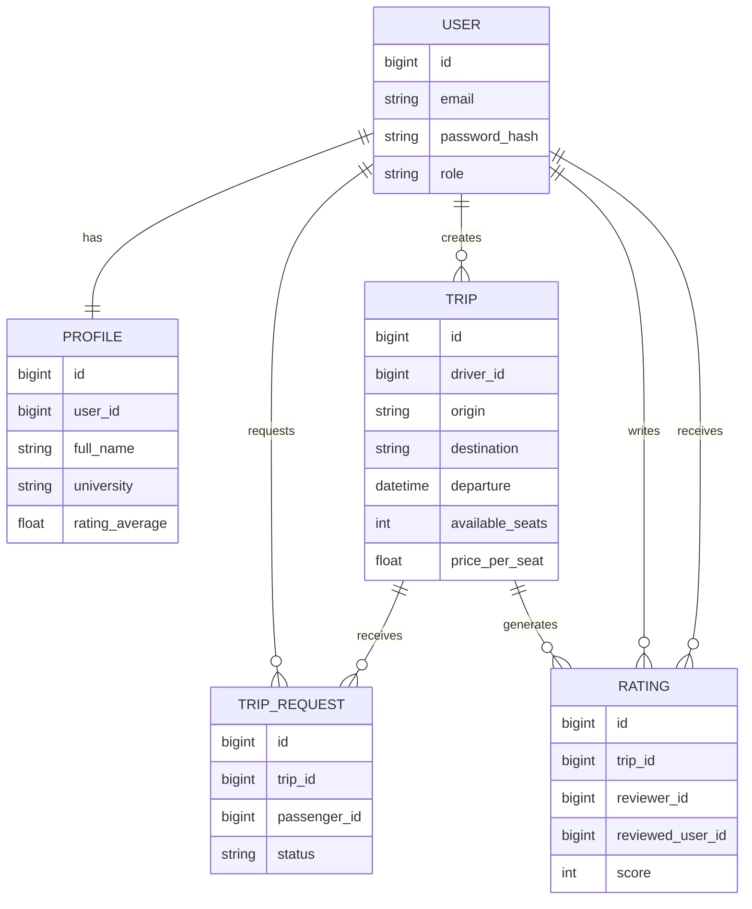

# UniRide – Domain Model

Domain model documentation for the **UniRide ride-sharing platform**.

This document describes the **core entities, relationships, and business rules** that define the system domain.

The domain model serves as the conceptual foundation for:

- the **database schema**
- the **REST API design**
- the **backend business logic**

UniRide follows a simple principle:

> each trip is an **independent trip instance**, created by a driver for a specific date and time, where other users may request a seat.

---

# Table of Contents

1. Introduction  
2. Domain Overview  
3. Core Entities  
4. Domain Diagram  
5. Entities  
6. Entity Relationships  
7. Business Rules  
8. Domain Lifecycle  
9. Modeling Decisions  
10. Summary  

---

# 1. Introduction

This document defines the **domain model** of the UniRide platform.

The goal is to clearly describe:

- the main entities of the system
- the relationships between them
- the business rules governing the platform

The domain model provides a **conceptual representation of the ride-sharing process** within a university community.

---

# 2. Domain Overview

UniRide is a university ride-sharing platform where:

- users can register and log in
- users can create personal profiles
- users can publish trips as drivers
- other users can request seats in those trips
- drivers can approve or reject requests
- the system records trip participation
- users can rate each other after completing a trip

The domain revolves around **coordinating individual trips between members of the same university community**.

---

# 3. Core Entities

The system is built around five core entities:

- **User**
- **Profile**
- **Trip**
- **TripRequest**
- **Rating**

Each entity represents a key concept within the ride-sharing workflow.

---

# 4. Domain Diagram



---

# 5. Entities

## 5.1 User

The **User** entity represents a registered account.

It manages **authentication and identification**.

### Main Attributes

- id  
- email  
- password_hash  
- role  
- is_active  
- created_at  
- updated_at  

### Notes

- Email uniquely identifies each user.
- Passwords are stored as **secure hashes**.
- A user may act as **driver or passenger** depending on the trip.

---

## 5.2 Profile

The **Profile** entity stores additional user information.

It is separated from the `User` entity to isolate **authentication data from public profile data**.

### Main Attributes

- id  
- user_id  
- full_name  
- university  
- phone_number  
- avatar_url  
- bio  
- rating_average  
- created_at  
- updated_at  

### Notes

- Each user has exactly **one profile**.
- Profiles provide information visible to other users.

---

## 5.3 Trip

The **Trip** entity represents a ride published by a driver.

This is the **central entity of the system**.

### Main Attributes

- id  
- driver_id  
- origin  
- destination  
- departure_date  
- departure_time  
- available_seats  
- price_per_seat  
- status  
- notes  
- created_at  
- updated_at  

### Notes

- Each trip belongs to one driver.
- Trips occur at a specific date and time.
- Available seats are limited.
- `price_per_seat` represents **cost sharing**, not a commercial fare.

### Trip Status

Trips may have the following states:

```
created
open
full
completed
cancelled
```

---

## 5.4 TripRequest

The **TripRequest** entity represents a passenger’s request to join a trip.

It models the **approval workflow** between passenger and driver.

### Main Attributes

- id  
- trip_id  
- passenger_id  
- status  
- message  
- created_at  
- updated_at  

### Notes

- Each request belongs to a specific trip.
- Requests are submitted by users acting as passengers.
- Drivers decide whether to approve or reject requests.

### Request Status

```
pending
approved
rejected
cancelled
```

A passenger becomes part of the trip once their request is **approved**.

---

## 5.5 Rating

The **Rating** entity represents feedback between users after completing a trip.

Its purpose is to **promote trust and accountability** within the community.

### Main Attributes

- id  
- trip_id  
- reviewer_id  
- reviewed_user_id  
- score  
- comment  
- created_at  

### Notes

- Ratings are associated with completed trips.
- Users may only rate **other participants** of the same trip.
- Scores typically range from **1 to 5**.

---

# 6. Entity Relationships

Relationships between entities:

- A **User** has one **Profile**
- A **User** can create multiple **Trips**
- A **User** can create multiple **TripRequests**
- A **Trip** belongs to one **driver**
- A **Trip** can receive multiple **TripRequests**
- A **TripRequest** belongs to one **Trip** and one **passenger**
- A completed **Trip** may generate multiple **Ratings**

These relationships define the **interaction flow of the system**.

---

# 7. Business Rules

The system enforces the following domain rules.

---

## User and Profile Rules

- Users must be authenticated to perform protected actions.
- Each user must have a **unique email address**.
- Each user must have **exactly one profile**.

---

## Trip Rules

- Only authenticated users can create trips.
- A trip must include origin, destination, date, time, and available seats.
- Trips cannot be created in the past.
- Available seats must be greater than zero.
- Only the driver can modify or cancel their trip.
- Cancelled trips cannot accept new requests.
- Completed trips cannot be modified.

---

## Seat Request Rules

- Only authenticated users can request seats.
- Drivers cannot request seats in their own trips.
- A user cannot submit multiple active requests for the same trip.
- Requests can only be made for **open trips**.
- Only the driver can approve or reject requests.
- When available seats reach zero, the trip becomes **full**.

---

## Participation Rules

- A passenger participates in a trip once their request is **approved**.
- The driver is always considered a participant.
- Users must be able to view:
  - trips they created
  - trips they joined

---

## Rating Rules

- Ratings can only be submitted **after a trip is completed**.
- Only participants of the same trip can rate each other.
- Users cannot rate themselves.
- Duplicate ratings for the same interaction must be prevented.

---

# 8. Domain Lifecycle

The main domain workflow:

```
User registers
      ↓
User creates profile
      ↓
Driver publishes trip
      ↓
Trip becomes visible
      ↓
Passenger requests seat
      ↓
Driver approves or rejects
      ↓
Passengers participate
      ↓
Trip completed
      ↓
Participants rate each other
```

This represents the **core workflow of the UniRide MVP**.

---

# 9. Modeling Decisions

To keep the system simple and maintainable:

- `User` and `Profile` are separated to isolate authentication data.
- `Trip` is the central entity of the system.
- `TripRequest` explicitly models the seat request workflow.
- Trip participation is derived from **approved requests**.
- `Rating` is modeled as a separate entity to maintain accountability.

---

# 10. Summary

The UniRide domain model is based on five core entities:

- User
- Profile
- Trip
- TripRequest
- Rating

The system centers around the workflow:

```
create trip
   ↓
request seat
   ↓
approve or reject
   ↓
complete trip
   ↓
rate participants
```

This domain model provides the conceptual basis for designing the **database schema and REST API of the platform**.